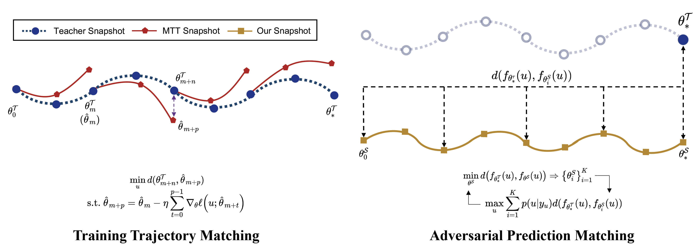
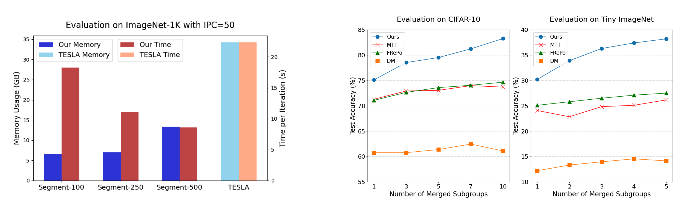
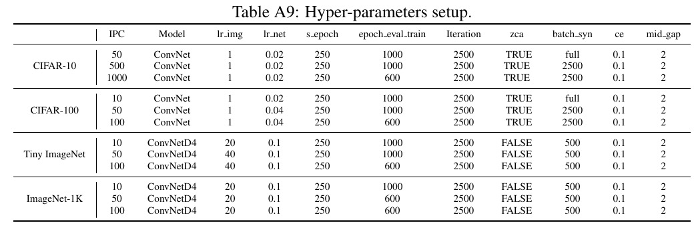

# Dataset Distillation via Adversarial Prediction Matching


This repo contains official code for the paper "[Dataset Distillation via Adversarial Prediction Matching](https://arxiv.org/abs/2312.08912)". 

Dataset distillation is the technique of synthesizing smaller condensed datasets from large original datasets while retaining necessary information to persist the effect.

In this paper, we approach the dataset distillation problem from a novel perspective: we regard minimizing the prediction discrepancy on the real data distribution between models, which are respectively trained on the large original dataset and on the small distilled dataset, as a conduit for condensing information from the raw data into the distilled version. An adversarial framework is proposed to solve the problem efficiently.



Compared to the training trajectory matching (MTT) based frameworks, our method has three primary advantages: 1. It imitates the converged teachers’ prediction, avoiding short-sightedness on local trajectories; 2. Synthetic samples are updated by a single-level loss function, significantly enhancing memory complexity; 3. It requires only one well-trained teacher rather than all the snapshots alongside the training, markedly diminishing storage overhead. This enables our method to require only **2.5× less memory** and **5× less runtime** than [TESLA](https://proceedings.mlr.press/v202/cui23e.html) for distilling ImageNet-1K. 



Moreover, our method also exhibits an interesting and practical **parallelizability for dataset distillation**. That is, it can divide the generation of a synthetic dataset and allocate it to multiple workers for parallel execution without compromising effectiveness. Please refer to our paper for more details.

### Getting Started

First, create the conda virtual enviroment

```bash
conda env create -f enviroment.yaml
```

You can then activate your  conda environment with
```bash
conda activate distillation
```

### Obtaining well-trained teachers to be matched
Before doing any distillation, you'll need to generate some teacher models on the original dataset by ```./model_train/train.py```

The following command will train 100 ConvNet models on CIFAR-10 with ZCA whitening for 100 epochs each:
```bash
python ./model_train/train.py --dataset=CIFAR10 --zca --model=ConvNet \
--train_epochs=100 --num_experts=100 --buffer_path=./model_train/models \
--data_path=your_data_path
```
There is an example in the ```./template.sh```


### Adversarial Prediction Matching 
The following command will then use the well-trained teachers we just generated to distill CIFAR-10 down to just 50 image per class:
```bash
python distill.py --model ConvNet --dataset CIFAR10 --zca --loss l1 --eval_mode ccc  \
--lr_img 1 --ipc 50 --s_epoch 250 --lr_net 0.02 --epoch_eval_train 1000 --num_eval 5 --soft_lab --mid_gap 2 --ce 0.1 \
--data_path=your_data_path
```

More examples for distilling other datasets with different IPCs can be found in the ```./template.sh```

Please use the following hyper-parameters to attain our results reported in Table 1 of the paper:


## Acknowledgement
Our code is built upon [MTT](https://github.com/GeorgeCazenavette/mtt-distillation) and [DC](https://github.com/VICO-UoE/DatasetCondensation).

## Citation
If you find our code useful for your research, please cite our paper.
```
@misc{chen2023dataset,
      title={Dataset Distillation via Adversarial Prediction Matching}, 
      author={Mingyang Chen and Bo Huang and Junda Lu and Bing Li and Yi Wang and Minhao Cheng and Wei Wang},
      year={2023},
      eprint={2312.08912},
      archivePrefix={arXiv},
      primaryClass={cs.CV}
}
```
